## Introduction

Write a short section on what the tutorial is aiming to accomplish.
What is the motivation behind the tutorial?
What do you want readers to gain from the tutorial?

### Learning Objectives

- Bullet list of skills/concepts to be covered

Any additional notes from the developers can be included here.

### Background Information

Describe your topic here. What does it do? Why do you use it?
Are there other similar things to use? What are the pros and cons?
Explain important concepts that are necessary to understand.
Include (and cite if needed) any visuals that will help the audience understand.

## Getting Started

<<<<<<< Updated upstream
<<<<<<< Updated upstream
For any software prerequisites, write a simple excerpt on each
technology the participant will be expecting to download and install.
Aim to demystify the technologies being used and explain any design
decisions that were taken. Walk through the installation processes
in detail. Be aware of any operating system differences.
For hardware prerequisites, list all the necessary components that
the participant will receive. A table showing component names and
quantities should suffice. Link any reference sheets or guides that
the participant may need.
The following are stylistic examples of possible prerequisites,
customize these for each workshop.

### Required Downloads and Installations
=======
## Part 1. Hardware : esp32 and BNO connection
>>>>>>> Stashed changes

### Introduction

This section is abot how to wire the BNO085 and ESP32 chip

<<<<<<< Updated upstream
List your required hardware components and the quantities here.

| Component Name | Quanitity |
| -------------- | --------- |
|                |           |
|                |           |

### Required Tools and Equipment
=======
### Objective

- learn critical thing about BNO wiring using I2C.  
- Software on how to get BNO data.  

### Background Information

To do this part, you will need:  
- Know how to use Kicad/Altium.
- know how to do SMT soldering.

### Components

- Computer with Kicad 8.0+

### Circuit design

1. For BNO sensors, you need to configure the communication protocols and choose between using an internal clock or external crystal. In this instruction, we will use I2C and internal clock.
2. First, we need to configure I2C.
   The following are the pin configurations:
- The H_INTN pin is the application interrupt line that indicates when the BNO08X requires attention. This should be
tied to a GPIO with wake capability. The interrupt is active low.
- NRST is the reset line for the BNO08X and can be driven by either the application processor or the board reset.
- BOOTN is sampled at reset. If low, the BNO08X will enter bootloader mode.
- Pin 4 (BOOTN) should be pulled high through a 10kΩ resistor. To use the device firmware update (DFU)
capability of the BNO08X, it is recommended to connect Pin 4 to a GPIO pin on the external microcontroller.
- Pin 5 (PS1) and Pin 6 (PS0/WAKE) are the host interface protocol selection pins. These pins should be tied to ground to select the I2C interface.
- Pin 17 (SA0) is used to select the lower bit of the 7-bit I2C slave device address. The BNO's I2C address can be 4A or 4B, where 4B is for slave devices. Grounding this pin will set the BNO as master, while connecting it to 3.3V will set this BNO in slave mode.
- Pull-up resistors (R1 and R2) are required on the I2C communication lines - Pin 19 (HOST_SCL) and Pin 20 (HOST_SDA). These values may vary depending on the board design and bus capacitance, but typical
values range between 2kΩ and 4kΩ.
- The BNO08X supports environmental sensors (e.g., pressure sensors, ambient light sensors) on a secondary I2C interface. This interface should be pulled up via resistors regardless of the presence of external sensors, as the software polls for sensors at reset. In other words, the BNO can also work as a master device.
  
The following image shows a connection example with external crystal from the BNO085 datasheet:  
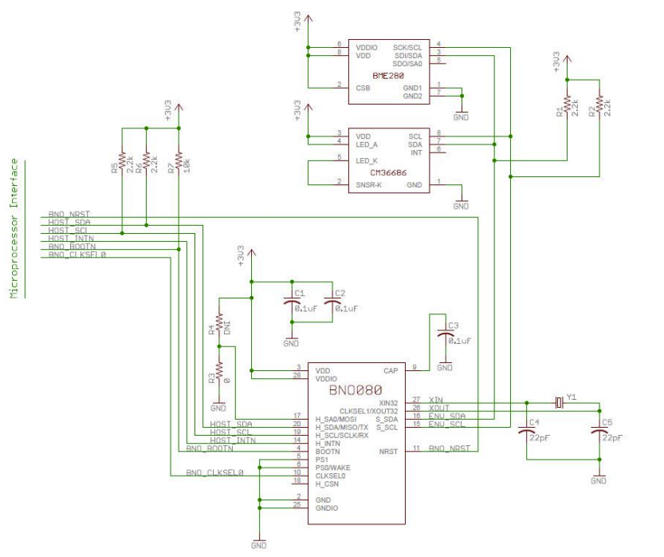  
  
3. Then we need to configure the correct clock mode:
   To do this, pull up pin 10 (CLKSEL0) and pull down pin 26 (CLKSEL1). 
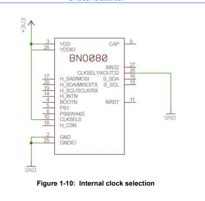

### Gerber and BOM Export
1. Before exporting, verify your design by running a DRC (Design Rule Check):
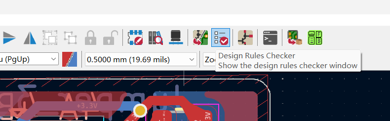  
Click on "Run DRC" and fix any reported errors. Consult with your TA for more detailed DRC setup guidance if needed.
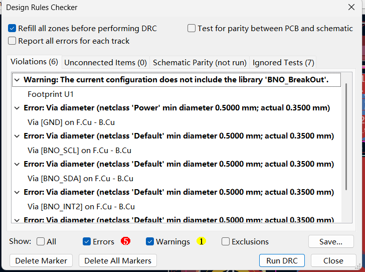  

2. Generating Gerber Files:
- Navigate to the PCB editor and select "Fabrication Output" -> "Gerbers"
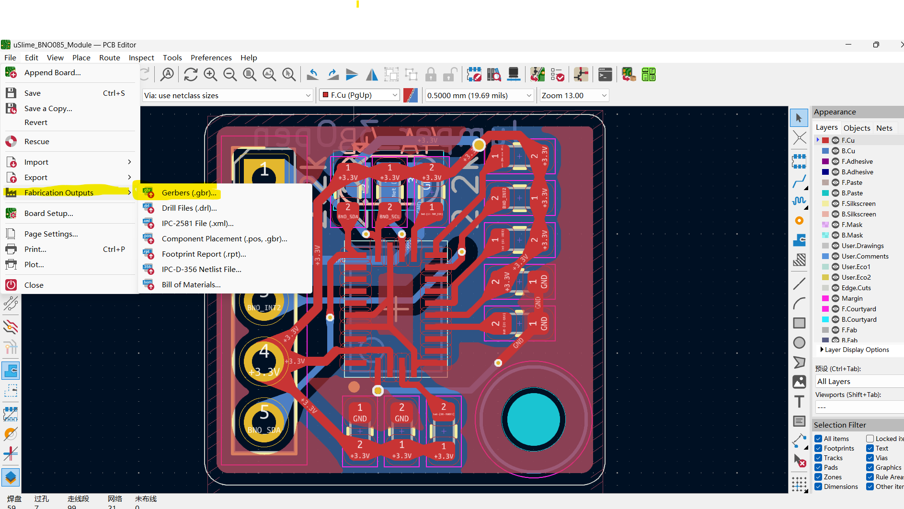
- Click on "Generate Drill Files", then click "Plot"
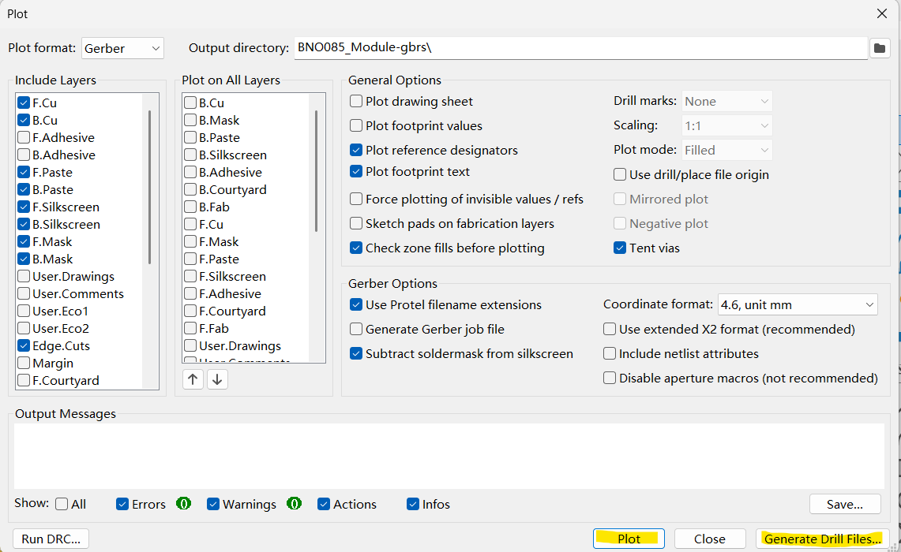
- Compress all the exported files into a ZIP archive for submission to the manufacturer

3. Bill of Materials (BOM):
- Navigate to the PCB editor and select "Fabrication Output" -> "Bill of Materials"
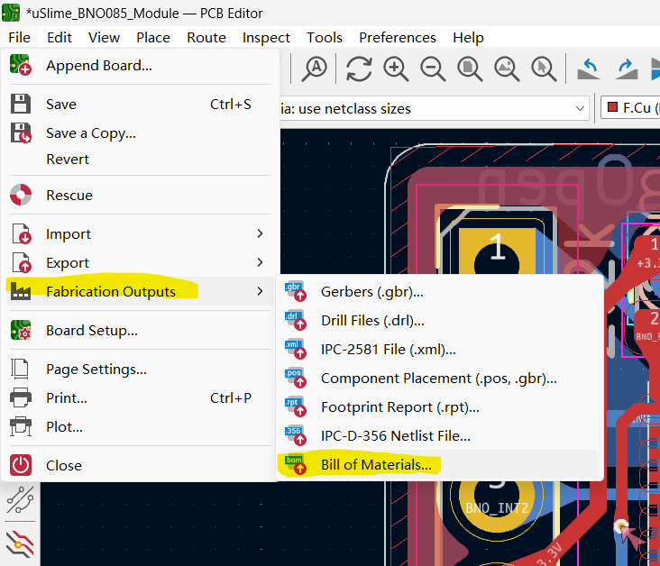   
The generated CSV file can be used for parts ordering.

4. Interactive HTML BOM (Optional):
- This KiCad plugin simplifies your assembly process significantly.
- To install, go to the KiCad homepage and click on "Plugin and Content Manager"
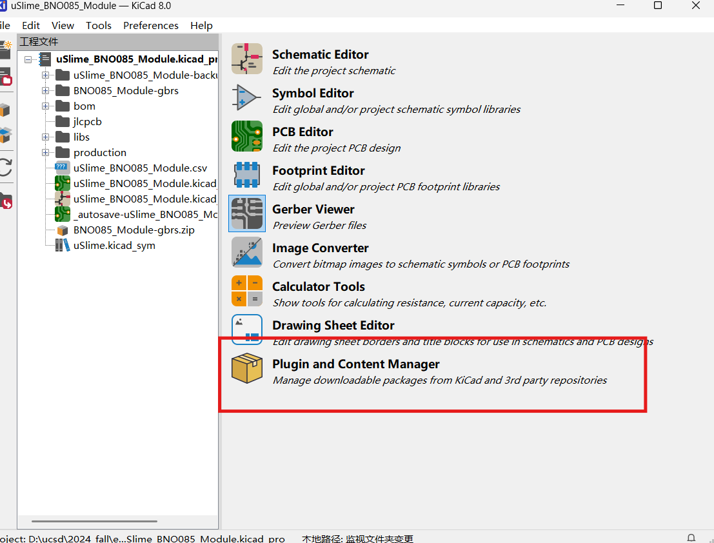
- Search for "Interactive HTML BOM" and install it
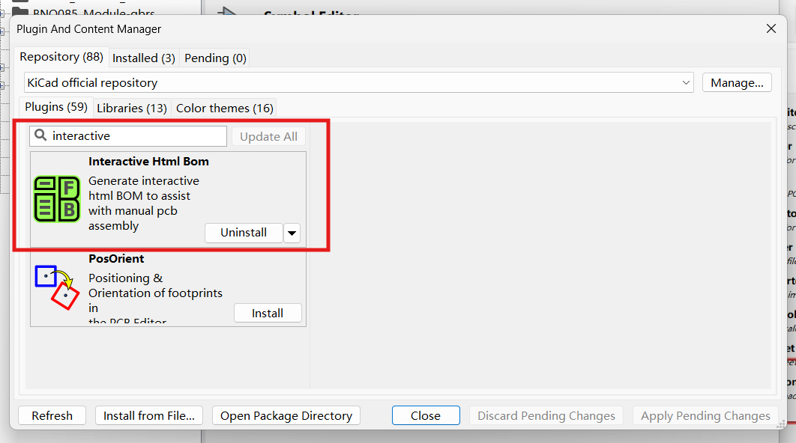  
- After installation, the plugin will appear in your PCB editor window. Click on it and select "Generate BOM"
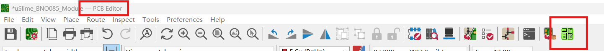  
- This will export a BOM with a rendered PCB view. Hovering over components will highlight their corresponding locations on the board


>>>>>>> Stashed changes

List any tools and equipment you need here.
(Ex, computer, soldering station, etc.)

<<<<<<< Updated upstream
## Part 01: Name

### Introduction

Briefly introduce what  you are teaching in this section.

### Objective

- List the learning objectives of this section

### Background Information

Give a brief explanation of the technical skills learned/needed
in this challenge. There is no need to go into detail as a
separation document should be prepared to explain more in depth
about the technical skills

### Components

- List the components needed in this challenge

### Instructional

Teach the contents of this section

## Example

### Introduction

Introduce the example that you are showing here.
=======
### Introduction

=======
## Part 1. Hardware : esp32 and BNO connection

### Introduction

This section is abot how to wire the BNO085 and ESP32 chip

### Objective

- learn critical thing about BNO wiring using I2C.  
- Software on how to get BNO data.  

### Background Information

To do this part, you will need:  
- Know how to use Kicad/Altium.
- know how to do SMT soldering.

### Components

- Computer with Kicad 8.0+

### Circuit design

1. For BNO sensors, you need to configure the communication protocols and choose between using an internal clock or external crystal. In this instruction, we will use I2C and internal clock.
2. First, we need to configure I2C.
   The following are the pin configurations:
- The H_INTN pin is the application interrupt line that indicates when the BNO08X requires attention. This should be
tied to a GPIO with wake capability. The interrupt is active low.
- NRST is the reset line for the BNO08X and can be driven by either the application processor or the board reset.
- BOOTN is sampled at reset. If low, the BNO08X will enter bootloader mode.
- Pin 4 (BOOTN) should be pulled high through a 10kΩ resistor. To use the device firmware update (DFU)
capability of the BNO08X, it is recommended to connect Pin 4 to a GPIO pin on the external microcontroller.
- Pin 5 (PS1) and Pin 6 (PS0/WAKE) are the host interface protocol selection pins. These pins should be tied to ground to select the I2C interface.
- Pin 17 (SA0) is used to select the lower bit of the 7-bit I2C slave device address. The BNO's I2C address can be 4A or 4B, where 4B is for slave devices. Grounding this pin will set the BNO as master, while connecting it to 3.3V will set this BNO in slave mode.
- Pull-up resistors (R1 and R2) are required on the I2C communication lines - Pin 19 (HOST_SCL) and Pin 20 (HOST_SDA). These values may vary depending on the board design and bus capacitance, but typical
values range between 2kΩ and 4kΩ.
- The BNO08X supports environmental sensors (e.g., pressure sensors, ambient light sensors) on a secondary I2C interface. This interface should be pulled up via resistors regardless of the presence of external sensors, as the software polls for sensors at reset. In other words, the BNO can also work as a master device.
  
The following image shows a connection example with external crystal from the BNO085 datasheet:  
  
  
3. Then we need to configure the correct clock mode:
   To do this, pull up pin 10 (CLKSEL0) and pull down pin 26 (CLKSEL1). 


### Gerber and BOM Export
1. Before exporting, verify your design by running a DRC (Design Rule Check):
  
Click on "Run DRC" and fix any reported errors. Consult with your TA for more detailed DRC setup guidance if needed.
  

2. Generating Gerber Files:
- Navigate to the PCB editor and select "Fabrication Output" -> "Gerbers"

- Click on "Generate Drill Files", then click "Plot"

- Compress all the exported files into a ZIP archive for submission to the manufacturer

3. Bill of Materials (BOM):
- Navigate to the PCB editor and select "Fabrication Output" -> "Bill of Materials"
   
The generated CSV file can be used for parts ordering.

4. Interactive HTML BOM (Optional):
- This KiCad plugin simplifies your assembly process significantly.
- To install, go to the KiCad homepage and click on "Plugin and Content Manager"

- Search for "Interactive HTML BOM" and install it
  
- After installation, the plugin will appear in your PCB editor window. Click on it and select "Generate BOM"
  
- This will export a BOM with a rendered PCB view. Hovering over components will highlight their corresponding locations on the board


## Part 01: Getting start with PlatfromIO

### Introduction

>>>>>>> Stashed changes
In this section, you will learn how to set up and program an ESP32-S3 development board using PlatformIO, an open-source ecosystem for IoT development. Key technical skills you need to know before starting this part include:

- Setting up PlatformIO in VS Code
- Understanding ESP32-S3 GPIO configuration and usage
- Basic C/C++ programming for embedded systems
- Serial communication and debugging
- Building and flashing firmware to ESP32

These foundational skills will be essential for implementing the security features of our smart lock system. More detailed technical documentation is available in separate guides.


### Objectives

- Set up the development environment with PlatformIO in VS Code
- Understand ESP32-S3 capabilities and pin configurations
- Develop firmware for motion detection and alarm triggering

### Instructions

#### 1. Setting Up PlatformIO

1. Install Visual Studio Code from [code.visualstudio.com](https://code.visualstudio.com/)
2. Install the PlatformIO extension from the VS Code Marketplace
3. Create a new project:
   - Select "Espressif ESP32-S3 Dev Module" as your board
   - Choose "Arduino" as your framework
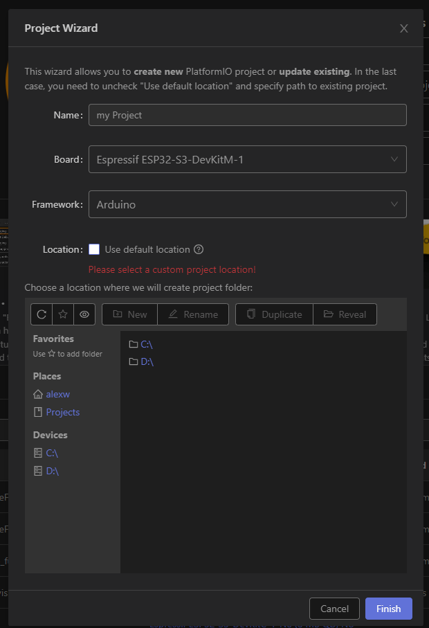   

#### 2. Basic Configuration

Add the following configuration to your `platformio.ini` file (make sure to comment out or remove any existing configuration):

```
[env:esp32-s3-devkitc-1]
platform = espressif32@^6.5.0
board = esp32-s3-devkitc-1
framework = arduino
monitor_speed = 115200
lib_deps = 
	SPI
	adafruit/Adafruit BusIO@^1.16.2
	sparkfun/SparkFun BNO08x Cortex Based IMU@^1.0.6
```

#### 3. Uploading the Code

1. Enable bootloader mode by holding down the BOOT button and pressing the reset button on your ESP32-S3 Dev Board.
2. Connect the ESP32-S3 Dev Board to your computer using the USB-C cable.
3. Copy the code from our github repository [Our Github Code Repository](https://github.com/ECE-196/final-project-team1) and paste it into the `main.cpp` file.
4. Select the "Upload and Monitor" option and click on the "Upload and Monitor" button.


#### Optional: Combination Lock PCB Design

If you want to add an extra layer of security beyond motion detection, you can create a simple combination lock using slide switches. You can use it provide a physical authentication method that must be correctly set before the scooter can be used, or served for a different type of more sensitive detection mode like we did.

We won't give too much details about the design process here, because this is more like an open-ended extra feature. But we'll provide our PCB design here:

   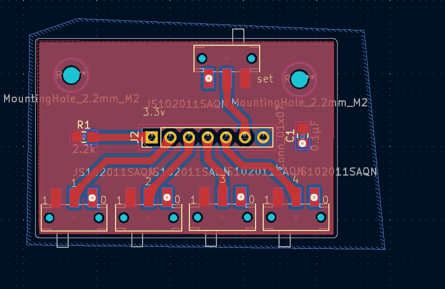 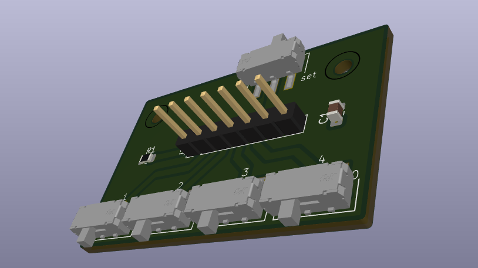
>>>>>>> Stashed changes

### Example

Present the example here. Include visuals to help better understanding

### Analysis

Explain how the example used your tutorial topic. Give in-depth analysis of each part and show your understanding of the tutorial topic

## Additional Resources

### Useful links

List any sources you used, documentation, helpful examples, similar projects etc.
