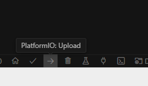
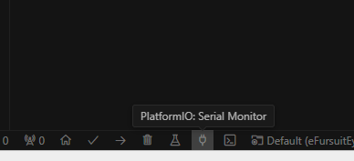

## Introduction

This tutorial guides you through building a custom anti-theft security system for electric scooters. With the alarming rate of increasing micro-mobility device theft such as electric scooters and bicycles on campus, it is very important to secure your electric scooter. Both of our team members have experienced their electric scooters being stolen in the past, and we know how important the issue is, so we want to help any UCSD student who is concerned by this issue. Our solution provides an affordable and effective way to secure your electric scooter using readily available components. We hope this tutorial can help you secure your electric scooter, gaining some practical embedded development skills, and save you from the headache of dealing with stolen scooters.

### Learning Objectives

- Understanding basic electronics and microcontroller programming
- Understanding basic PCB design
- Building a motion detection system with BNO sensors
- Developing practical problem solving skills

### Background Information

Micro-mobility devices, including bikes and electric scooters, are easily stolen on the UCSD campus. 
According to the 2024 Annual Security & Fire Safety Report from the UCSD Police Department, theft of micro-mobility devices such as electric scooters and bicycles has increased at an alarming rate. Causing thousands of dollar lost and extremely inconvenience for students and faculties.


## Part 1. Hardware : esp32 and BNO connection

### Introduction

This section guides you through the PCB design and setup process for connecting the BNO085 sensor to the ESP32 chip.

### Objective

- Learn critical thing about BNO wiring using I2C.  
- Learn software coding on how to get BNO data.  

### Background Information

To do this part, you will need to know :  
- How to use Kicad/Altium.
- How to do SMT soldering.

### Components

- Computer with Kicad 8.0+
- BNO085 sensor
- ESP32-S3 Dev Board


### Circuit design

1. For BNO sensors, you need to configure the communication protocols and choose between using an internal clock or external crystal. In this instruction, we will use I2C and internal clock.
2. First, we need to configure I2C.
   The following are the pin configurations:
- The H_INTN pin is the application interrupt line that indicates when the BNO08X requires attention. This should be
tied to a GPIO with wake capability. The interrupt is active low.

- NRST is the reset line for the BNO08X and can be driven by either the application processor or the board reset.

- BOOTN is sampled at reset. If low, the BNO08X will enter bootloader mode.
- Pin 4 (BOOTN) should be pulled high through a 10kΩ resistor. To use the device firmware update (DFU) capability of the BNO08X, it is recommended to connect Pin 4 to a GPIO pin on the external microcontroller.
- Pin 5 (PS1) and Pin 6 (PS0/WAKE) are the host interface protocol selection pins. These pins should be tied to ground to select the I2C interface.
- Pin 17 (SA0) is used to select the lower bit of the 7-bit I2C slave device address. The BNO's I2C address can be 4A or 4B, where 4B is for slave devices. Grounding this pin will set the BNO as master, while connecting it to 3.3V will set this BNO in slave mode.
- Pull-up resistors (R1 and R2) are required on the I2C communication lines - Pin 19 (HOST_SCL) and Pin 20 (HOST_SDA). These values may vary depending on the board design and bus capacitance, but typical
values range between 2kΩ and 4kΩ.
- The BNO08X supports environmental sensors (e.g., pressure sensors, ambient light sensors) on a secondary I2C interface. This interface should be pulled up via resistors regardless of the presence of external sensors, as the software polls for sensors at reset. In other words, the BNO can also work as a master device.

<br>

The following image shows a connection example with external crystal from the BNO085 datasheet:  

  
  

3. Then we need to configure the correct clock mode:
   To do this, pull up pin 10 (CLKSEL0) and pull down pin 26 (CLKSEL1). 


<br>

### Gerber and BOM Export
1. Before exporting, verify your design by running a DRC (Design Rule Check):

  
<br>
Click on "Run DRC" and fix any reported errors. Consult with your TA for more detailed DRC setup guidance if needed.

  

2. Generating Gerber Files:
- Navigate to the PCB editor and select "Fabrication Output" -> "Gerbers"


<br>

- Click on "Generate Drill Files", then click "Plot"


- Compress all the exported files into a ZIP archive for submission to the manufacturer

3. Bill of Materials (BOM):
- Navigate to the PCB editor and select "Fabrication Output" -> "Bill of Materials"

   
The generated CSV file can be used for parts ordering.

4. Interactive HTML BOM (Optional):
- This KiCad plugin simplifies your assembly process significantly.
- To install, go to the KiCad homepage and click on "Plugin and Content Manager"


- Search for "Interactive HTML BOM" and install it

  
- After installation, the plugin will appear in your PCB editor window. Click on it and select "Generate BOM"

  
- This will export a BOM with a rendered PCB view. Hovering over components will highlight their corresponding locations on the board


<br>
<br>
<br>

## Part 02. Software: Getting start with PlatfromIO

### Introduction
In this section, you will learn how to set up and program an ESP32-S3 devboard using PlatformIO, an open-source ecosystem for IoT development.  

### Objectives

- Set up the development environment with PlatformIO in VS Code
- Understand ESP32-S3 capabilities and pin configurations
- Develop firmware for motion detection and alarm triggering

### Background Information

Key technical skills you need to know before starting this part include:

- Understanding ESP32-S3 GPIO configuration and usage
- Basic C/C++ programming for embedded systems
- Serial communication and debugging
- Building and flashing firmware to ESP32

These foundational skills will also be needed for implementing the security features of our smart lock system. More detailed technical documentation is available in separate guides.


### Instructions

#### 1. Setting Up PlatformIO

1. Install Visual Studio Code from [code.visualstudio.com](https://code.visualstudio.com/)
2. Install the PlatformIO extension from the VS Code Extensions Marketplace
3. Create a new project:
   - Select "Espressif ESP32-S3 Dev Module" as your board
   - Choose "Arduino" as your framework
   

#### 2. Basic Configuration

Add the following configuration to your `platformio.ini` file (make sure to comment out or remove any existing configuration):

```
[env:esp32-s3-devkitc-1]
platform = espressif32@^6.5.0
board = esp32-s3-devkitc-1
framework = arduino
monitor_speed = 115200
lib_deps = 
	SPI
	adafruit/Adafruit BusIO@^1.16.2
	sparkfun/SparkFun BNO08x Cortex Based IMU@^1.0.6
```

#### 3. Uploading the Code

1. Enable bootloader mode by holding down the BOOT button and pressing the reset button on your ESP32-S3 Dev Board.
2. Connect the ESP32-S3 Dev Board to your computer using a USB-C cable.
3. Copy the code from our github repository [Our Github Code Repository](https://github.com/ECE-196/final-project-team1) and paste it into the `main.cpp` file.
4. Select the "Upload and Monitor" option and click on the "Upload and Monitor" button.  
                  


#### Optional: Combination Lock PCB Design

If you want to add an extra layer of security beyond motion detection, you can create a simple combination lock using slide switches. You can use it provide a physical authentication method that must be correctly set before the scooter can be used, or served for a different type of more sensitive detection mode like we did.

We won't give too much details about the design process here, because this is more like an open-ended extra feature. But we'll provide our PCB design here:

    

### Example

Once you have went through all the previous steps and conquered all the software nuances, and if you have 3D-printed an enclosure you like, you can start to build your own anti-theft system! Here is an example of what our final product looks like.


### Analysis

Our anti-theft system combines multiple security layers for maximum protection. The enclosure design is critical for several reasons:

1. **Protection**: The enclosure shields sensitive electronics from weather, tampering, and physical damage.

2. **Integration**: A well-designed enclosure allows seamless mounting on different scooter models without compromising aesthetics or functionality.

3. **Usability**: The placement of components affects user experience - the speaker needs to be audible, the sensors properly positioned to detect motion, and any status LEDs visible.

The optional combination lock adds a physical security layer that complements the electronic detection system. This dual-authentication approach significantly increases security. Even if someone attempts to move your scooter, the alarm will sound, and without the correct combination of the switches, they cannot disable it.

The BNO085 sensors are positioned strategically to detect any movement of the scooter, while the ESP32 processes this information and triggers the alarm when unauthorized movement is detected. The entire system is designed to be power-efficient, allowing for extended battery life while providing robust security.

## Additional Resources

### Useful links

[BNO085 Datasheet](https://www.mouser.com/datasheet/2/1480/BNO080_085_Datasheet-3196201.pdf)

[BNO Example Code](https://github.com/sparkfun/SparkFun_BNO08x_Arduino_Library/blob/main/examples/Example_11_RawReadings/Example_11_RawReadings.ino)

[Onshape Tutorial](https://learn.onshape.com)

[Our Github Code Repository](https://github.com/ECE-196/final-project-team1)
