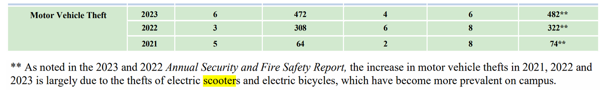

## Introduction

This tutorial guides you through building a custom anti-theft security system for electric scooters. With the alarming rate of increasing micro-mobility device theft such as electric scooters and bicycles on campus, it is very important to secure your electric scooter. Both of our team members have experienced their electric scooters being stolen in the past, and we know how important the issue is, so we want to help any UCSD student who is concerned by this issue. Our solution provides an affordable and effective way to secure your electric scooter using readily available components. We hope this tutorial can help you secure your electric scooter, gaining some practical embedded development skills, and save you from the headache of dealing with stolen scooters.

### Learning Objectives

- Understanding basic electronics and microcontroller programming
- Understanding basic PCB design
- Building a motion detection system with BNO sensors
- Developing practical problem solving skills

### Background Information

Micro-mobility devices, including bikes and electric scooters, are easily stolen on the UCSD campus. 
According to the 2024 Annual Security & Fire Safety Report from the UCSD Police Department, theft of micro-mobility devices such as electric scooters and bicycles has increased at an alarming rate. Causing thousands of dollar lost and extremely inconvenience for students and faculties.


## Getting Started

### Required Downloads and Installations

List any required downloads and installations here.
Make sure to include tutorials on how to install them.
You can either make your own tutorials or include a link to them.

### Required Components

This is all the electrical components needed for the project.

| Component Name | Quantity |
|----------------|-----------|
| ESP32-S3 Dev Board | 1 |
| ESP32-C6-MINI-1-N4 | 1 |
| JS102011SAQN Slide Switch | 5 |
| Conn_01x05 PinHeader_1x05_P2.54mm_Vertical | 1 |
| 603 0.1uF Capacitor | 4 |
| 603 10kΩ Resistor | 3 |
| 603 2.2kΩ Resistor | 4 |
| BNO085 Sensor | 2 |
| 3W DC Speaker | 1 |
| LP103454 3.7V Battery | 2 |
| Dupont Wire | Based On Need |

You also need to 3D-printed some enclosures for putting the boards onto your scooter and your lock.

### Required Tools and Equipment
Soldering station, hot plate, solder paste, bike lock, e-scooter/bike.  
Not required, but recommended: logic analyzer, stencil holder.

## Part 01: ESP32

### Introduction

In this section we are about to introduce how to use platform IO to build firmware on ESP32-S3 Dev Board.

### Objective

- Set up the development environment with PlatformIO in VS Code
- Understand ESP32-S3 capabilities and pin configuration
- Develop firmware for motion detection and alarm triggering

### Background Information

In this section, you will learn how to set up and program an ESP32-S3 development board using PlatformIO, an open-source ecosystem for IoT development. Key technical skills you need to know before starting this part include:

- Setting up PlatformIO in VS Code
- Understanding ESP32-S3 GPIO configuration and usage
- Basic C/C++ programming for embedded systems
- Serial communication and debugging
- Building and flashing firmware to ESP32

These foundational skills will be essential for implementing the security features of our smart lock system. More detailed technical documentation is available in separate guides.

### Components

- The ESP32-S3 Dev Board mentioned above.
- An USB-C cable.
- A computer with VS Code and Platform IO extension installed.

### Instructional

#### 1. Setting Up PlatformIO

1. Install VS Code from [code.visualstudio.com](https://code.visualstudio.com/)
2. Install the PlatformIO extension from the VS Code marketplace.
3. Create a new project, selecting "Espressif ESP32-S3 Dev Module" as the board and "Arduino" as the framework

#### 2. Basic Configuration

Add the following to your `platformio.ini` file:

```
[env:esp32-s3-devkitc-1]
platform = espressif32@^6.5.0
board = esp32-s3-devkitc-1
framework = arduino
monitor_speed = 115200
lib_deps = 
	SPI
	adafruit/Adafruit BusIO@^1.16.2
	sparkfun/SparkFun BNO08x Cortex Based IMU@^1.0.6
```

#### 3. Uploading the Code

1. Enable bootloader mode by holding down the BOOT button and pressing the reset button on your ESP32-S3 Dev Board.
2. Connect the ESP32-S3 Dev Board to your computer using the USB-C cable.
3. Copy the code from our github repository [Our Github Code Repository](https://github.com/ECE-196/final-project-team1) and paste it into the `main.cpp` file.
4. Select the "Upload and Monitor" option and click on the "Upload and Monitor" button.

## Part 02: BNO 085

### Introduction

This section is about how to use and BNO 085 IMU on ESP32

### Objective

- learn critical thing about BNO wiring using I2C.  
- Software on how to get BNO data.  

### Background Information

To do this part, you will need:  
- Know how to use Kicad/Altium.
- know how to do SMT soldering.

### Components

- Computer with Kicad 8.0+

### Instructional

1. On BNOs you would need to configure the communication protocals, and if you are using an internal clock or external crystal. In this instruction, we would use I2C and internal clock.
2. First we would need to configure I2c
   the following are pins configuration:
- The H_INTN pin is the application interrupt line that indicates the BNO08X requires attention. This should be
tied to a GPIO with wake capability. The interrupt is active low.
- NRST is the reset line for the BNO08X and can be either driven by the application processor or the board reset.
- BOOTN is sampled at reset. If low the BNO08X will enter bootloader mode.
- Pin 4 (BOOTN) should be pulled high through a 10K Ohms resistor. To use the device firmware update (DFU)
capability of the BNO08X, it is recommended to connect Pin 4 to a GPIO pin on the external microcontroller.
-  Pin 5 (PS1) and Pin 6 (PS0/WAKE) are the host interface protocol selection pins. These pins should be tied to ground to select the I2C interface.
-  Pin 17 (SA0) can be used to select the lower bit of the 7-bit I2C slave device address, BNO's I2C address can be 4A or 4B, 4B is for slave device. Ground this pin will set BNO as master, connect to 3.3v will make this BNO In slave mode.
- Pull up resistors (R1 and R2) are needed on the I2C communication lines - Pin 19 (HOST_SCL) and Pin 20 (HOST_SDA). These values may vary depending on the board design and bus capacitance, but typical
values are between 2KΩ and 4KΩ.
- The BNO08X supports environmental sensors (e.g. pressure sensors, ambient light sensors) on a secondary I2C interface. This interface should be pulled up via resistors regardless of the presence of the external sensor as the SW polls for sensors at reset. In another world, BNO can also work as a master device.
3. Then we need to configure the correct clock mode:
  To do that we need to pull up pin 10(CLKSEL0), and pull down pin 26(CLKSEL1). If you want to usd external crystal, please refer to BNO datasheet page 11.


## Part 03: Hardware Design

### Introduction

This section covers the physical design aspects of our anti-theft system, including creating enclosures for the electronics and designing an optional combination lock PCB to enhance security.

### Objective

- Design and create enclosures for the electronic components using CAD software
- Learn how to integrate the components into a practical form factor
- Optionally design a simple combination lock PCB as an additional security feature

### Background Information

To complete this part, you will need:
- Experience with CAD software (Onshape,Fusion360, etc.)
- For the optional combination lock: knowledge of PCB design using KiCAD
- Understanding of how to export designs for 3D printing

Onshape is a cloud-based CAD software that allows you to create 3D models for your enclosures. The free educational version is sufficient for this project. If you're unfamiliar with Onshape, we recommend completing some basic tutorials before proceeding.

### Components

- Computer with Onshape account (free educational version available)
- 3D printer access (through your university makerspace or commercial service)
- For combination lock option:
  - Computer with KiCAD 8.0+ installed
  - PCB manufacturing capability (either through university resources or commercial services)

### Instructional

#### Designing the Enclosure

1. **Planning Your Enclosure**
   - Measure all your components (ESP32 board, BNO085 sensors, battery, speaker)
   - Sketch a rough layout of how components will fit together
   - Consider mounting points for attaching to your scooter and lock

2. **Creating the Design in Onshape**
   - Log in to your Onshape account and create a new document
   - Start with a base sketch for the main enclosure body
   - Create appropriate cavities for each component
   - Design snap-fit or screw mounts for easy assembly
   - Add ventilation if needed for heat dissipation
   - Design cable routing paths between components
   - Create mounting brackets or attachment points specific to your scooter model

3. **Preparing for 3D Printing**
   - Export your design as an STL file
   - Choose appropriate print settings (we recommend 20% infill, 0.2mm layer height)
   - Select a durable material like PETG or ABS for outdoor use

4. **Assembly Considerations**
   - Design the enclosure in multiple parts for easier printing and assembly
   - Include access points for charging and programming
   - Consider waterproofing options for outdoor use

#### Optional: Combination Lock PCB Design

If you want to add an extra layer of security beyond motion detection, you can create a simple combination lock using slide switches. You can use it provide a physical authentication method that must be correctly set before the scooter can be used, or served for a different type of more sensitive detection mode like we did.

We won't give too much details about the design process here, because this is more like an open-ended extra feature. But we'll provide our PCB design here:

    

### Example

Once you have went through all the previous steps and conquered all the software nuances, and if you have 3D-printed an enclosure you like, you can start to build your own anti-theft system! Here is an example of our final product.


### Analysis

Our anti-theft system combines multiple security layers for maximum protection. The enclosure design is critical for several reasons:

1. **Protection**: The enclosure shields sensitive electronics from weather, tampering, and physical damage.

2. **Integration**: A well-designed enclosure allows seamless mounting on different scooter models without compromising aesthetics or functionality.

3. **Usability**: The placement of components affects user experience - the speaker needs to be audible, the sensors properly positioned to detect motion, and any status LEDs visible.

The optional combination lock adds a physical security layer that complements the electronic detection system. This dual-authentication approach (something you know - the combination, and something you have - your phone) significantly increases security. Even if someone attempts to move your scooter, the alarm will sound, and without the correct combination, they cannot disable it.

The BNO085 sensors are positioned strategically to detect any movement of the scooter, while the ESP32 processes this information and triggers the alarm when unauthorized movement is detected. The entire system is designed to be power-efficient, allowing for extended battery life while providing robust security.

## Additional Resources

### Useful links

[BNO085 Datasheet](https://www.mouser.com/datasheet/2/1480/BNO080_085_Datasheet-3196201.pdf)
[BNO Example Code](https://github.com/sparkfun/SparkFun_BNO08x_Arduino_Library/blob/main/examples/Example_11_RawReadings/Example_11_RawReadings.ino)
[Onshape Tutorial](https://learn.onshape.com)
[Our Github Code Repository](https://github.com/ECE-196/final-project-team1)
